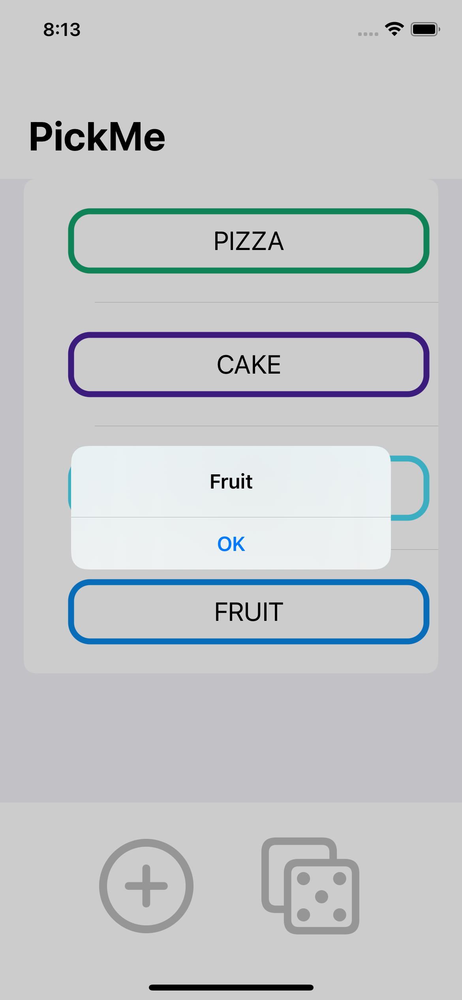

# PickMe (SwiftUI Decision Maker)

PickMe is an app built to help people make a decision.
The user enters a  few options and the app randomly returns one.

Feel Free to Check Out the Code!

## ScreenShots

### Welcome Screen

Only two options when launching the screen: Add an options or roll for an option. But without any options present you'll get this message:

### Adding An Option

Clicking on the "Plus" button brings up the add option sheet. On the sheet there is a quote and a textfield where the user can enter an option. Clicking the "Add" button doesn't dismiss the sheet but clears the text field and lets the user enter another option. Once all options, the user wants, have been entered then clicking on the "Done" button closes the sheet.

### Screen After A Few Options

The screen with a few options that the user has inputed. The border colors are randomly generated. 

### Deleting An Option

Swiping from left to right on an option will bring up the ability to delete an option.

### Rolling For An Option

Clicking on the "Dice" button returns a random option in the form of an alert. The user can dismiss the alert an reroll if they would like to.